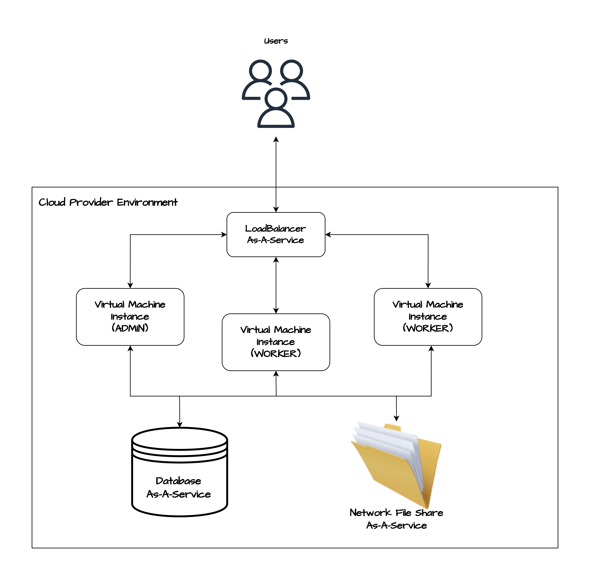

# WIP

## Software Architecture of the Project
The high-level view of the software architecture of the project consists of the following:

- An Ubuntu virtual machine (or EC2 instance)
- A MySQL database
- A PHP + WordPress installation
- The Apache web server

## High-Level Cloud Infrastructure of the Project

## Deployment CheckList
- [ ] Launch and configure private network resources in your cloud provider.
- [ ] Set up the database as a service.
- [ ] Implement NFS filesystem as a service.
- [ ] Deploy and configure the load balancer service.
- [ ] Gather information on launched services and resources.
- [ ] Dynamically generate scripts to bootstrap admin and web virtual machine instances.
- [ ] Launch the admin virtual machine instance with the generated script, updating the OS, installing necessary software, configuring NFS, and setting up WordPress.
- [ ] Launch web/worker virtual machine instances with the generated script, updating the OS, installing required software, configuring NFS, and starting the webserver.
- [ ] Register all virtual machine instances with the load balancer for traffic distribution.

