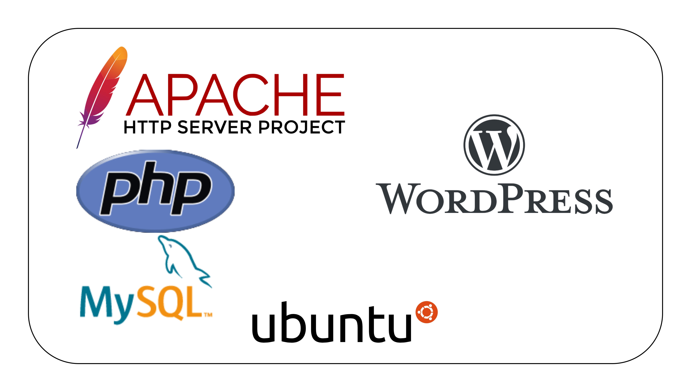

# Infrastructure Deployment with Ansible and Terraform

## Software Architecture of the Project
The high-level view of the software architecture of the project consists of the following:



- An Ubuntu virtual machine (or EC2 instance)
- A MySQL database
- A PHP + WordPress installation
- The Apache web server


## High-Level Cloud Infrastructure of the Project


## Deployment CheckList
- [ X ] Launch and configure private network resources in your cloud provider.
- [ X ] Set up the database as a service.
- [ X ] Implement NFS filesystem as a service.
- [ X ] Deploy and configure the load balancer service.
- [ X ] Gather information on launched services and resources.
- [ X ] Dynamically generate scripts to bootstrap admin and web virtual machine instances.
- [ X ] Launch the admin virtual machine instance with the generated script, updating the OS, installing necessary software, configuring NFS, and setting up WordPress.
- [ X ] Launch web/worker virtual machine instances with the generated script, updating the OS, installing required software, configuring NFS, and starting the webserver.
- [ X ] Register all virtual machine instances with the load balancer for traffic distribution.

## Setting Up The Infrastructure
- Navigate into the `terrafrom` directory in the [repo](https://github.com/TaskMasterErnest/Infrastructure-As-Code-With-WordPress-And-Terraform)
- To change the default variables used in deploying the infrastructure, go to the `99-variables.tf` and `01-setup.tf` files to set up your different values.
- Make sure to have Terraform installed; initialize the Terraform project with:
```Bash
terraform init
```
- Then, to check the execution plan produced by Terraform for the project:
```Bash
terraform plan
```
- If everything is alright, go ahead and deploy the infrastructure with:
```Bash
terraform apply
```


## Accessing the WordPress Admin Instance
- There will be 3 outputs; 
	- the Address to use to access the WordPress application in the instances,
	- the username to use to Login to the WordPress admin instance,
	- the password to use to Login to the WordPress instance labelled sensitive.
- To view the password, run the command `terraform output -json`. It will output all the above outputs unto you terminal and you can use these to access the WordPress instances.